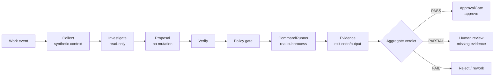
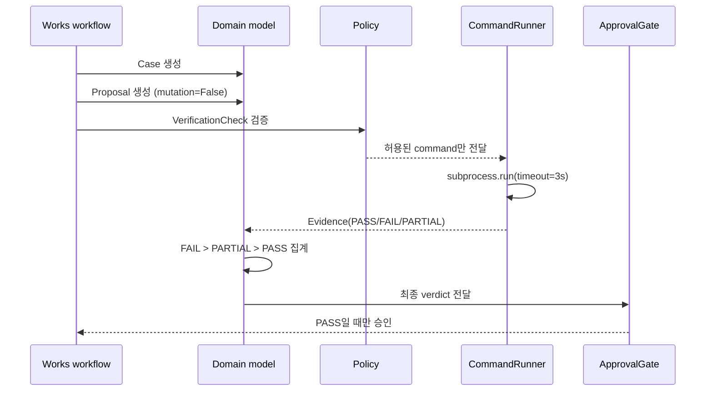
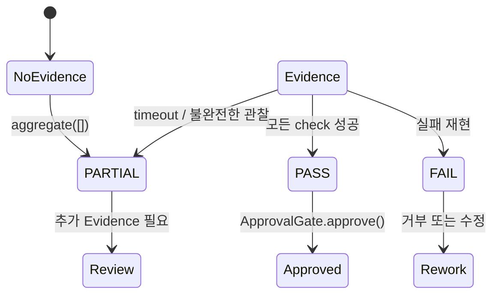
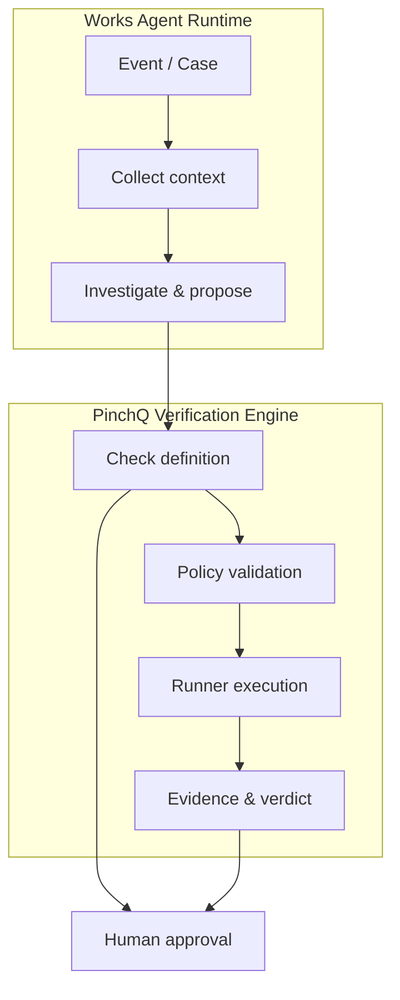

# Works Agent System — Executable Demo

[](https://github.com/devcy0922/works-agent-demo/actions/workflows/ci.yml)
[](https://devcy0922.github.io/works-agent-demo/)
[](LICENSE)

> Works Agent Runtime과 PinchQ Verification Engine의 핵심 신뢰 경계를 작은 실행 가능한 데모로 재현합니다.

이 저장소는 포트폴리오용 제품 복제본이 아니라, **AI가 조사하고 제안하되 실행 결과와 최종 승인은 분리하는 업무 자동화 흐름**을 직접 확인하는 public-safe reference implementation입니다.

실제 제품 소스·프롬프트·커넥터·운영 데이터는 포함하지 않습니다. 화면과 실행 예제는 synthetic/anonymized data만 사용합니다.

## 먼저 보는 데모 흐름



핵심은 `Proposal`이 실행 권한이 아니라는 점입니다. `PASS`는 모델의 판단이나 화면 상태가 아니라, 허용된 runner가 남긴 실행 Evidence에서만 만들어집니다.

## 실행해 보기

### 브라우저 데모

별도 백엔드나 API key 없이 정적 UI를 실행합니다.

```bash
python3 -m http.server 8080
```

그 다음 <http://localhost:8080>을 엽니다. UI에서 `PASS`, `PARTIAL`, `FAIL` 시나리오별로 검증과 승인 경계가 어떻게 달라지는지 확인할 수 있습니다.

### Python reference path

브라우저 UI와 별도로, 실제 로컬 subprocess를 실행하는 최소 workflow를 확인할 수 있습니다.

```bash
python3 -m pip install -e . pytest
pytest -q
python3 -c "from works_agent_demo.runtime import run_workflow; print(run_workflow('pass')[2].value)"
```

`pass`는 성공적인 명령 Evidence를, `fail`은 non-zero exit를, `partial`은 timeout을 만듭니다.

## 실제로 구현된 경계



| 경계 | 데모 구현 |
|---|---|
| Work intake / case | `Case`와 synthetic event |
| Investigation | `SyntheticCollector`, `Investigator` |
| Proposed action | `Proposal`, mutation 없음 |
| Execution policy | destructive command 차단 (`rm`, `sudo`, `mkfs`, `dd`) |
| Verification runner | 실제 로컬 `CommandRunner` 1종 |
| Observation | exit code, stdout, stderr, timeout |
| Verdict | `FAIL > PARTIAL > PASS`, evidence 없음은 `PARTIAL` |
| Consequence authority | `ApprovalGate`, `PASS`만 승인 가능 |

## Verdict와 fail-closed 규칙



- `PASS`: 필요한 검증이 실행되고 모두 성공함
- `PARTIAL`: Evidence가 없거나 환경 제약으로 검증을 끝내지 못함
- `FAIL`: 실제 명령 실패가 관찰됨
- 여러 결과가 섞이면 `FAIL > PARTIAL > PASS` 우선순위를 적용함
- `PASS`가 아니면 승인 경계를 통과할 수 없음

## Works와 PinchQ의 책임 분리



이 저장소에서 실제 Python 경로로 확인 가능한 것은 위 경계의 최소 reference입니다. 운영 시스템에서 확장 가능한 `HTTP`, `PTY`, `Browser` runner와 planner 개념은 [verification boundary 문서](architecture/verification-boundary.md)에 설명되어 있지만, 이 공개 데모에 해당 구현이 포함되어 있다는 뜻은 아닙니다.

## Repository map

```text
.
├── index.html / app.js / styles.css       # backend 없는 시각적 walkthrough
├── src/works_agent_demo/
│   ├── domain.py                           # Evidence, verdict, approval gate
│   └── runtime.py                          # collector, proposal, policy, runner
├── tests/test_reference_workflow.py        # 실행·우선순위·정책·승인 테스트
├── architecture/                           # 시스템·workflow·verification 경계
├── decisions/                              # 설계 결정 기록
├── evidence/                               # synthetic evidence/report 예제
├── demo/README.md                          # 데모 계약과 시나리오
└── SANITIZATION.md                         # 공개 데이터 경계
```

## 범위와 비공개 영역

포함 범위는 시스템 경계, synthetic investigation, 실제 command observation, verdict aggregation, approval rule입니다. 다음은 의도적으로 제외했습니다.

- production agent/planner 구현과 private prompt
- 실제 DB·log·SCM connector 및 MCP 설정
- HTTP/PTY/browser runner의 production adapter
- 배포 토폴로지, 인증, secrets, 운영 데이터
- 외부 시스템에 대한 mutation/write

자세한 공개 데이터 원칙은 [`SANITIZATION.md`](SANITIZATION.md), 설계 설명은 [`architecture/system-overview.md`](architecture/system-overview.md), 실행 계약은 [`demo/README.md`](demo/README.md)를 참고하세요.

## License

MIT. 자세한 내용은 [`LICENSE`](LICENSE)를 확인하세요.
