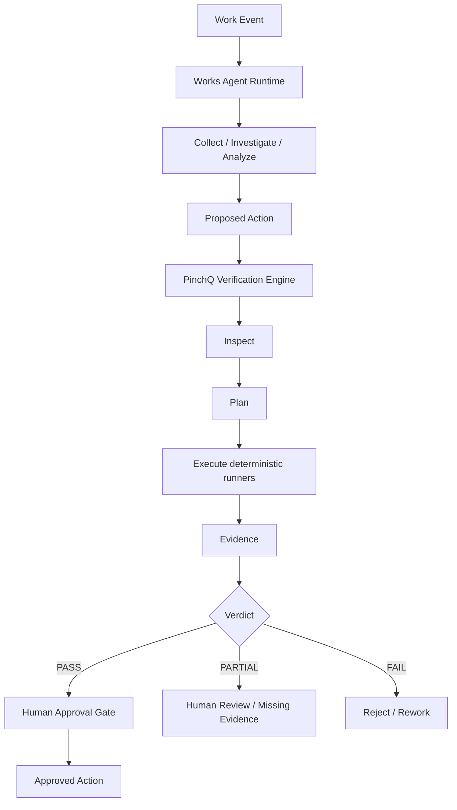

# Works Agent System — Demo

[](https://github.com/devcy0922/works-agent-demo/actions/workflows/ci.yml)
[](https://devcy0922.github.io/works-agent-demo/)
[](LICENSE)

> An interactive demo of an evidence-based agent workflow.

> AI가 결정을 대신하는 시스템이 아니라, **AI가 조사하고 제안하며 실행 결과를 검증 가능한 Evidence로 만든 뒤 사람이 최종 결정하는 업무 자동화 시스템**입니다.

이 저장소는 두 개의 private implementation에서 가져온 구조를 하나의 데모 흐름으로 묶어 보여줍니다.

- **Works Agent Runtime** — 업무 인입, 조사, 분석, 제안, 승인 수명주기
- **PinchQ Verification Engine** — 변경 분석, 검증 계획, 실제 실행 Evidence, `PASS / FAIL / PARTIAL`

실제 제품 소스, 프롬프트, 배포 구성, 사내 connector, 운영 데이터는 포함하지 않습니다. 화면과 실행 예제의 데이터는 모두 **synthetic / anonymized data**입니다.

## Demo purpose

이 데모는 agent 시스템이 어떤 순서로 움직이고 어디에서 멈추는지 빠르게 보여주기 위한 것입니다. 작은 실행 코드와 테스트로 다음 규칙을 확인할 수 있습니다.

- 실행 Evidence가 없으면 `PASS`가 될 수 없습니다.
- `FAIL > PARTIAL > PASS` 우선순위로 불확실성과 실패를 보존합니다.
- 제안 단계는 mutation을 수행하지 않으며, 승인 없이는 action을 통과시키지 않습니다.
- command 실행은 policy gate를 거치고, destructive command는 거부됩니다.

## Run the demo

루트의 `index.html`은 별도 backend 없이 동작하는 시각적 데모입니다. `src/`에는 같은 흐름을 로컬에서 실행해 보는 작은 Python 예제가 있습니다.

```bash
python3 -m http.server 8080
# http://localhost:8080
```

```bash
python3 -m pip install -e . pytest
pytest -q
python3 -c "from works_agent_demo.runtime import run_workflow; print(run_workflow('pass')[2].value)"
```

위 Python workflow는 synthetic collector와 proposal을 거친 뒤 실제 로컬 subprocess를 실행해 Evidence를 만듭니다. `fail`과 `partial` 시나리오로 실패와 불완전한 검증의 차이도 확인할 수 있습니다.

데모에서는 세 가지 검증 결과를 선택할 수 있습니다.

- `PASS` — 모든 필수 검증이 실행 Evidence로 통과
- `PARTIAL` — 환경/의존성 제약으로 일부 검증을 완료하지 못함
- `FAIL` — 실제 실패가 재현됨

최종 승인 버튼은 `PASS`일 때만 활성화됩니다. 실제 시스템 전체가 아니라, 핵심 흐름과 경계만 데모용으로 단순화했습니다.

## System flow



## Responsibility boundary

| Area | Owner |
|---|---|
| Work event intake | Works |
| DB / log / knowledge investigation | Works |
| LLM-assisted analysis | Works |
| Proposed action | Works |
| Change inspection | PinchQ |
| Verification planning | PinchQ |
| Command / HTTP / PTY / browser execution | PinchQ |
| Evidence & verdict | PinchQ |
| Human approval | Works |
| Audit trail | Works |

핵심 원칙은 **Planner와 Runner를 분리하고, LLM 판단만으로 PASS를 만들지 않는 것**입니다.

## Repository map

```text
.
├── index.html
├── styles.css
├── app.js
├── src/works_agent_demo/
│   ├── domain.py       # Evidence, verdict precedence, approval gate
│   └── runtime.py       # collector, investigator, policy, command runner
├── tests/
│   └── test_reference_workflow.py
├── architecture/
│   ├── system-overview.md
│   ├── agent-workflow.md
│   └── verification-boundary.md
├── decisions/
│   ├── why-human-in-the-loop.md
│   ├── why-evidence-based-verification.md
│   └── why-local-first.md
├── evidence/
│   ├── incident-example.json
│   ├── verification-result.json
│   └── sample-report.md
├── demo/
│   └── README.md
├── docs/
│   └── case-study.md
└── SANITIZATION.md
```

## What is intentionally not public

- private `src/`, `internal/` implementation
- production prompts / agent implementation
- planner and runner internals beyond the demo contracts
- production Docker/deployment manifests
- actual connector/MCP configuration
- secrets, tokens, hosts, usernames, private repository names
- company database schema, routes, tickets, issue numbers, customer data

## Demo scope and boundaries

이 데모는 private 소스 전체를 공개하지 않고, 아래 흐름과 경계를 문서와 실행 코드로 보여줍니다.

1. 시스템 경계와 데이터 흐름
2. Human-in-the-loop 설계 이유
3. Evidence 기반 검증 계약
4. `PASS / FAIL / PARTIAL` 의미
5. synthetic incident가 조사 → 검증 → 승인으로 진행되는 과정
6. 실제 private implementation과 공개 demo 사이의 sanitization 원칙

실행 예제는 의도적으로 작습니다. 운영 수준의 분산 실행, 실제 connector, LLM 품질, 브라우저 자동화와 인증은 범위 밖이며 `SANITIZATION.md`에 데모 데이터 원칙을 기록했습니다.

## Project labels

GitHub 이슈는 `bug`, `enhancement`, `documentation`, `security`, `triage`, `good first issue` 라벨을 사용합니다. Issue template은 재현 절차와 데모 흐름에 미치는 영향을 함께 남기도록 구성했습니다.

자세한 내용은 [`docs/case-study.md`](docs/case-study.md)와 [`architecture/system-overview.md`](architecture/system-overview.md)를 참고하세요.
