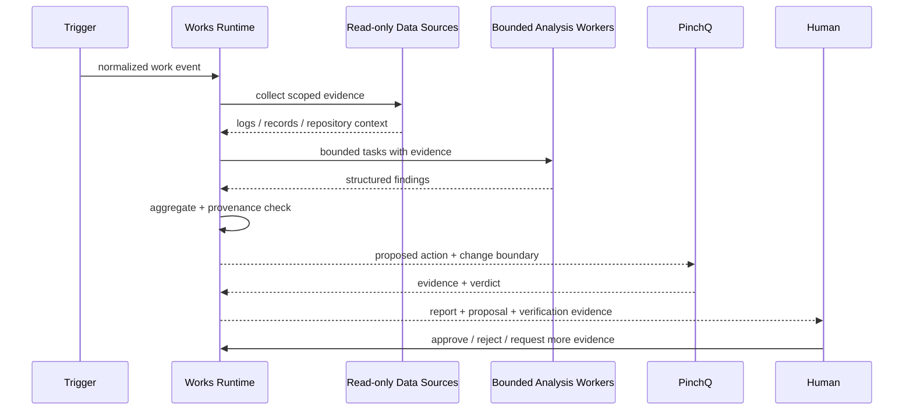

# Agent Workflow

## Purpose

Works is responsible for turning a raw work event into a bounded investigation and a proposed next action. The workflow is designed so the model does not receive unrestricted execution authority.

## Lifecycle

## Why bounded workers

The workflow separates a business lifecycle step from a model judgment.

- A **workflow node** owns state transition and lifecycle.
- A **worker/handler** owns one bounded transformation or judgment.
- A **service** coordinates application behavior.
- A **runner** executes a verification action and produces evidence.

The same responsibility should not be duplicated across these layers.

## Evidence envelope

Every meaningful finding should be traceable to the evidence used to produce it. This demo reduces the idea to three fictional sources:

- `app-logs-demo`
- `orders-readonly`
- `example/checkout-service`

Production source identifiers are intentionally replaced with demo identifiers.

## Failure behavior

### Collection failure

If a required source is unavailable, the workflow records the missing scope rather than fabricating a result.

### Model/gateway failure

Top-level orchestration may fail fast and be retried by the execution backend when the failure is transient. Bounded fan-out workers may degrade independently so one worker does not necessarily erase all collected evidence.

### Verification failure

Works does not reinterpret a PinchQ `FAIL` into success. Verification evidence remains authoritative for the execution result.

### Approval

Investigation and verification complete before mutation. Approval is a durable boundary, not a prompt token such as “please confirm”.
