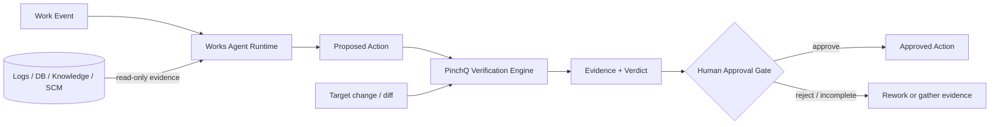
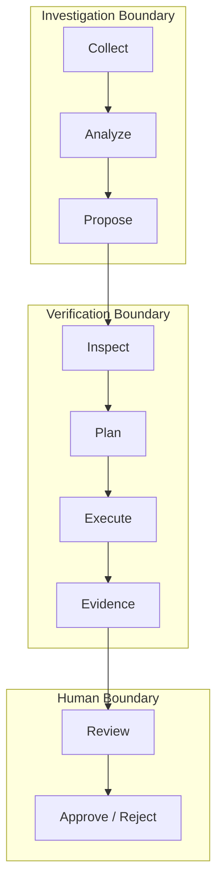

# System Overview

## Goal

The system is designed for operational work where an AI can accelerate investigation and planning, but the final action must remain auditable and reviewable.

The public architecture deliberately separates three kinds of authority:

1. **Context authority** — Works gathers and interprets operational evidence.
2. **Execution authority** — PinchQ runs narrow verification adapters and records observations.
3. **Consequence authority** — a human approves or rejects the proposed action.

## Context diagram



## Component responsibilities

### Works Agent Runtime

```text
Trigger / Collector
      ↓
Case envelope
      ↓
Read-only evidence collection
      ↓
Bounded analysis workers
      ↓
Aggregate / report
      ↓
Proposed Action
      ↓
Human-facing lifecycle & audit
```

Works owns the work lifecycle, not the truth of a code change. It may propose a fix, response or next action, but it does not turn model confidence into a verification verdict.

### PinchQ Verification Engine

```text
Repository / Diff
      ↓
Analyzer
      ↓
Planner
      ↓
Policy Validator
      ↓
Verification Plan
      ↓
Command / HTTP / PTY / Browser runners
      ↓
Evidence
      ↓
PASS / FAIL / PARTIAL
```

A planner can decide **what should be checked**. Only runners can observe **what actually happened**.

### Human Approval Gate

The approval boundary consumes the proposal and verification evidence. It is intentionally outside the model loop.

- `PASS` — required checks produced passing execution evidence.
- `FAIL` — at least one product failure was reproduced.
- `PARTIAL` — verification could not be completed because evidence is missing or an environmental limitation prevented a required check.

Aggregate precedence:

```text
FAIL > PARTIAL > PASS
```

A later passing check cannot erase a reproduced failure.

## Trust boundaries



## Public/private split

This repository publishes contracts, diagrams, synthetic examples and an interactive deterministic demo. The following remain private:

- production source and prompts
- deployment topology
- connector implementations
- internal repository / ticket / host identifiers
- actual data models and customer data
- credentials and policy configuration

See [`../SANITIZATION.md`](../SANITIZATION.md) for the public-data rules.
